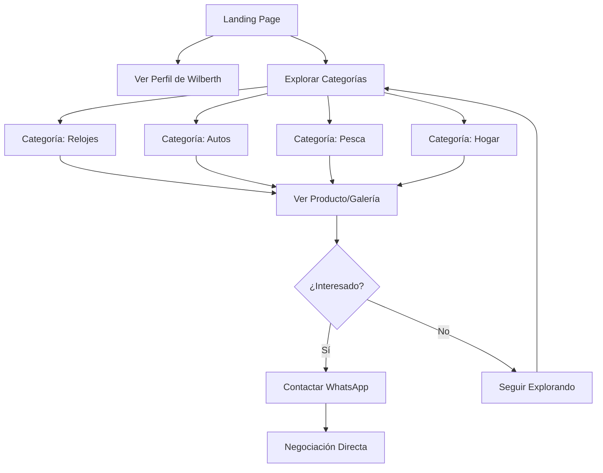

# Arquitectura de wilberth.com - Perfil de Vendedor Personal

> **Versión:** 1.0  
> **Fecha:** 2025-10-10  
> **Estado del Proyecto:** Astro + Tailwind CSS + Turso DB (LibSQL)

---

## 📋 Tabla de Contenidos

1. [Visión General](#visión-general)
2. [Esquema de Base de Datos](#esquema-de-base-de-datos)
3. [Arquitectura de Información](#arquitectura-de-información)
4. [Diseño UX/UI](#diseño-uxui)
5. [Estructura de Archivos](#estructura-de-archivos)
6. [Estrategia de Implementación](#estrategia-de-implementación)
7. [Especificaciones Técnicas](#especificaciones-técnicas)

---

## 🎯 Visión General

### Propósito del Sitio
**wilberth.com** es el perfil digital de Wilberth, un vendedor independiente que actúa como intermediario comercial. El sitio debe comunicar claramente que:
- Es un perfil personal, NO una tienda corporativa
- Wilberth NO es dueño de los productos, actúa como vendedor/intermediario
- Facilita la conexión entre compradores y productos disponibles

### Información de Contacto
- **Nombre:** Wilberth (con "th")
- **Email:** info@wilberth.com
- **WhatsApp/Teléfono:** +506 85008393
- **País:** Costa Rica

### Categorías de Productos
1. **Relojes** (Watches)
2. **Autos Usados** (Used Cars) - Requieren negociación presencial
3. **Artículos de Pesca Deportiva** (Sport Fishing Equipment)
4. **Artículos del Hogar** (Home Items/Decor)

### Sistema de Dos Fases

#### Fase 1 - Galerías Simples (PRIORITARIO)
- Galerías organizadas por categoría
- Solo imágenes sin descripciones detalladas
- Fácil de actualizar y mantener
- Enfoque en rapidez de publicación

#### Fase 2 - Sistema Completo (FUTURO)
- Productos con descripción completa
- Precios y especificaciones técnicas
- Sistema de filtrado avanzado
- Gestión detallada de inventario

**IMPORTANTE:** El sistema debe permitir que ambas fases coexistan. Algunos productos pueden tener detalles completos mientras otros permanecen en formato de galería.

---

## 💾 Esquema de Base de Datos

### Esquema Simple

Este es un esquema **SIMPLE** diseñado para ser fácil de mantener. Solo tiene dos tablas básicas.

#### 1. `products`
Tabla para almacenar productos que Wilberth vende.

```sql
CREATE TABLE IF NOT EXISTS products (
  id INTEGER PRIMARY KEY AUTOINCREMENT,
  name TEXT NOT NULL,
  price REAL NOT NULL,
  description TEXT,
  image_url TEXT,
  category TEXT CHECK(category IN ('Reloj', 'Auto usado', 'Hogar', 'Artículos de pesca')) NOT NULL
);
```

**Campos:**
- `id`: Identificador único del producto
- `name`: Nombre del producto
- `price`: Precio del producto
- `description`: Descripción opcional
- `image_url`: URL de la imagen
- `category`: Categoría del producto (ENUM con validación CHECK)
  - Valores permitidos: `'Reloj'`, `'Auto usado'`, `'Hogar'`, `'Artículos de pesca'`
  - Campo obligatorio (NOT NULL)

#### 2. `services`
Tabla para almacenar servicios que Wilberth ofrece.

```sql
CREATE TABLE IF NOT EXISTS services (
  id INTEGER PRIMARY KEY AUTOINCREMENT,
  name TEXT NOT NULL,
  price REAL NOT NULL,
  description TEXT,
  image_url TEXT
);
```

**Campos:**
- `id`: Identificador único del servicio
- `name`: Nombre del servicio
- `price`: Precio del servicio
- `description`: Descripción opcional
- `image_url`: URL de la imagen

### Información del Vendedor

La información de contacto de Wilberth se maneja directamente en el código:
- **Nombre:** Wilberth
- **Email:** info@wilberth.com
- **WhatsApp:** +506 85008393

**No se necesita tabla para el vendedor** porque solo hay UN vendedor.

---

## 🗂️ Arquitectura de Información

### Estructura de Navegación

```
wilberth.com/
│
├── Inicio (Hero + Presentación)
│   ├── Hero Section (Foto + Nombre + Rol)
│   ├── Sobre Mí (Bio corta)
│   └── Categorías Destacadas
│
├── Categorías
│   ├── /relojes
│   ├── /autos-usados
│   ├── /pesca-deportiva
│   └── /hogar
│
├── Contacto (Sticky/Visible)
│   ├── WhatsApp (Principal)
│   ├── Teléfono
│   └── Email
│
└── Producto Individual (Fase 2)
    └── /producto/[slug]
```

### Jerarquía de Contenido

#### Nivel 1: Página Principal
**Prioridad:** Establecer identidad del vendedor
1. Hero con foto de Wilberth
2. Mensaje claro: "Vendedor Independiente"
3. Categorías de productos
4. Contacto visible

#### Nivel 2: Páginas de Categoría
**Prioridad:** Mostrar productos disponibles
1. Título de categoría
2. Breve descripción
3. Galería de productos (grid)
4. Información de contacto/compra

#### Nivel 3: Detalle de Producto (Fase 2)
**Prioridad:** Información completa
1. Imágenes del producto
2. Descripción y especificaciones
3. Precio (si aplicable)
4. Botón de contacto directo

### Flujo de Usuario



---

## 🎨 Diseño UX/UI

### Principios de Diseño
1. **Minimalista:** Enfoque en el contenido, sin elementos innecesarios
2. **Personal:** Reflejar la identidad de Wilberth como vendedor
3. **Profesional:** Transmitir confianza y credibilidad
4. **Accesible:** Contacto siempre visible y fácil de usar

### Paleta de Colores Sugerida

```css
/* Colores Principales */
--color-primary: #1E40AF;      /* Azul profesional */
--color-primary-dark: #1E3A8A; /* Azul oscuro */
--color-secondary: #10B981;    /* Verde acento (WhatsApp-friendly) */

/* Colores Neutros */
--color-background: #FFFFFF;   /* Blanco limpio */
--color-surface: #F9FAFB;      /* Gris muy claro */
--color-border: #E5E7EB;       /* Gris borde */

/* Colores de Texto */
--color-text-primary: #111827;   /* Negro suave */
--color-text-secondary: #6B7280; /* Gris texto */

/* Colores de Estado */
--color-success: #10B981;   /* Verde */
--color-warning: #F59E0B;   /* Amarillo */
--color-error: #EF4444;     /* Rojo */
```

### Tipografía

```css
/* Sistema de Fuentes */
--font-primary: 'Inter', -apple-system, BlinkMacSystemFont, 'Segoe UI', sans-serif;
--font-display: 'Inter', sans-serif;

/* Escala Tipográfica */
--text-xs: 0.75rem;    /* 12px */
--text-sm: 0.875rem;   /* 14px */
--text-base: 1rem;     /* 16px */
--text-lg: 1.125rem;   /* 18px */
--text-xl: 1.25rem;    /* 20px */
--text-2xl: 1.5rem;    /* 24px */
--text-3xl: 1.875rem;  /* 30px */
--text-4xl: 2.25rem;   /* 36px */
```

### Wireframes

#### 1. Página Principal (Desktop)

```
┌────────────────────────────────────────────────────────────┐
│ HEADER - Navegación Fija                                  │
│ [LOGO: Wilberth]  [Categorías ▾]  [Contacto] [WhatsApp]  │
└────────────────────────────────────────────────────────────┘
│                                                            │
│  ┌──────────────────────────────────────────────────────┐ │
│  │         HERO SECTION - Perfil del Vendedor          │ │
│  │                                                      │ │
│  │     ┌────────┐                                      │ │
│  │     │        │    Wilberth                          │ │
│  │     │ FOTO   │    Vendedor Independiente            │ │
│  │     │        │                                      │ │
│  │     └────────┘    "Conectándote con los productos   │ │
│  │                    que necesitas"                   │ │
│  │                                                      │ │
│  │     [📱 Contactar por WhatsApp] [📧 Email]         │ │
│  └──────────────────────────────────────────────────────┘ │
│                                                            │
│  ┌──────────────────────────────────────────────────────┐ │
│  │  SOBRE MÍ                                           │ │
│  │                                                      │ │
│  │  Breve biografía de 2-3 líneas explicando que      │ │
│  │  Wilberth actúa como intermediario/vendedor         │ │
│  │  independiente y su experiencia.                    │ │
│  └──────────────────────────────────────────────────────┘ │
│                                                            │
│  ┌──────────────────────────────────────────────────────┐ │
│  │  CATEGORÍAS DE PRODUCTOS                            │ │
│  │                                                      │ │
│  │  ┌───────┐  ┌───────┐  ┌───────┐  ┌───────┐       │ │
│  │  │ 🕐    │  │ 🚗    │  │ 🎣    │  │ 🏠    │       │ │
│  │  │Relojes│  │ Autos │  │ Pesca │  │ Hogar │       │ │
│  │  └───────┘  └───────┘  └───────┘  └───────┘       │ │
│  └──────────────────────────────────────────────────────┘ │
│                                                            │
│  ┌──────────────────────────────────────────────────────┐ │
│  │  PRODUCTOS DESTACADOS                                │ │
│  │                                                      │ │
│  │  [IMG] [IMG] [IMG] [IMG]                           │ │
│  │  Grid de 4 productos destacados                     │ │
│  └──────────────────────────────────────────────────────┘ │
│                                                            │
└────────────────────────────────────────────────────────────┘
│ FOOTER                                                     │
│ Wilberth - Vendedor Independiente                        │
│ ☎ +506 85008393 | ✉ info@wilberth.com                   │
└────────────────────────────────────────────────────────────┘
```

#### 2. Página de Categoría - Fase 1 (Galería Simple)

```
┌────────────────────────────────────────────────────────────┐
│ HEADER                                                     │
└────────────────────────────────────────────────────────────┘
│                                                            │
│  ┌──────────────────────────────────────────────────────┐ │
│  │  📍 Inicio > Relojes                                 │ │
│  │                                                      │ │
│  │  ╔════════════════════════════════════════════════╗ │ │
│  │  ║  Relojes                                       ║ │ │
│  │  ║  Diversas marcas y estilos disponibles         ║ │ │
│  │  ╚════════════════════════════════════════════════╝ │ │
│  └──────────────────────────────────────────────────────┘ │
│                                                            │
│  ┌──────────────────────────────────────────────────────┐ │
│  │  GALERÍA DE PRODUCTOS (Grid 4 columnas)            │ │
│  │                                                      │ │
│  │  ┌────┐  ┌────┐  ┌────┐  ┌────┐                   │ │
│  │  │IMG │  │IMG │  │IMG │  │IMG │                   │ │
│  │  │    │  │    │  │    │  │    │                   │ │
│  │  └────┘  └────┘  └────┘  └────┘                   │ │
│  │  Reloj 1 Reloj 2 Reloj 3 Reloj 4                   │ │
│  │  [Ver]   [Ver]   [Ver]   [Ver]                     │ │
│  │                                                      │ │
│  │  ┌────┐  ┌────┐  ┌────┐  ┌────┐                   │ │
│  │  │IMG │  │IMG │  │IMG │  │IMG │                   │ │
│  │  │    │  │    │  │    │  │    │                   │ │
│  │  └────┘  └────┘  └────┘  └────┘                   │ │
│  │                                                      │ │
│  └──────────────────────────────────────────────────────┘ │
│                                                            │
│  [💬 ¿Interesado? Contáctame por WhatsApp]               │
│                                                            │
└────────────────────────────────────────────────────────────┘
│ FOOTER                                                     │
└────────────────────────────────────────────────────────────┘
```

#### 3. Detalle de Producto - Fase 2

```
┌────────────────────────────────────────────────────────────┐
│ HEADER                                                     │
└────────────────────────────────────────────────────────────┘
│                                                            │
│  ┌──────────────────────────────────────────────────────┐ │
│  │  📍 Inicio > Relojes > Rolex Submariner             │ │
│  └──────────────────────────────────────────────────────┘ │
│                                                            │
│  ┌─────────────────┬──────────────────────────────────┐  │
│  │                 │  Rolex Submariner                │  │
│  │  ┌───────────┐  │                                  │  │
│  │  │           │  │  Reloj de lujo en excelente      │  │
│  │  │   IMG     │  │  condición. Modelo clásico.      │  │
│  │  │ PRINCIPAL │  │                                  │  │
│  │  │           │  │  Precio: $8,500 USD              │  │
│  │  └───────────┘  │  (Precio negociable)             │  │
│  │                 │                                  │  │
│  │  [🖼][🖼][🖼]   │  Especificaciones:               │  │
│  │  Miniaturas     │  • Marca: Rolex                  │  │
│  │                 │  • Modelo: Submariner             │  │
│  │                 │  • Año: 2018                      │  │
│  │                 │  • Condición: Excelente           │  │
│  │                 │                                  │  │
│  │                 │  ✅ Envío disponible              │  │
│  │                 │  📦 Empaque seguro                │  │
│  │                 │                                  │  │
│  │                 │  [💬 Contactar por WhatsApp]     │  │
│  │                 │  [📧 Enviar Email]                │  │
│  └─────────────────┴──────────────────────────────────┘  │
│                                                            │
└────────────────────────────────────────────────────────────┘
```

#### 4. Mobile - Página Principal

```
┌──────────────────┐
│  ☰  Wilberth   📱│
├──────────────────┤
│                  │
│   ┌──────────┐   │
│   │          │   │
│   │   FOTO   │   │
│   │          │   │
│   └──────────┘   │
│                  │
│    Wilberth      │
│    Vendedor      │
│    Independiente │
│                  │
│ [📱 WhatsApp]    │
│ [📧 Email]       │
│                  │
├──────────────────┤
│  SOBRE MÍ        │
│                  │
│  Breve bio aquí  │
│                  │
├──────────────────┤
│  CATEGORÍAS      │
│                  │
│  ┌─────┐┌─────┐  │
│  │ 🕐  ││ 🚗  │  │
│  │Reloj││Autos│  │
│  └─────┘└─────┘  │
│                  │
│  ┌─────┐┌─────┐  │
│  │ 🎣  ││ 🏠  │  │
│  │Pesca││Hogar│  │
│  └─────┘└─────┘  │
│                  │
├──────────────────┤
│  DESTACADOS      │
│                  │
│  ┌──────────┐    │
│  │   IMG    │    │
│  └──────────┘    │
│  Producto 1      │
│                  │
└──────────────────┘
```

### Componentes UI Clave

#### 1. Hero del Vendedor
```html
<!-- Ejemplo de estructura -->
<section class="hero">
  <div class="hero-content">
    
    <h1>Wilberth</h1>
    <p class="role">Vendedor Independiente</p>
    <p class="tagline">Conectándote con los productos que necesitas</p>
    <div class="cta-buttons">
      <a href="https://wa.me/50685008393" class="btn-whatsapp">
        💬 Contactar por WhatsApp
      </a>
      <a href="mailto:info@wilberth.com" class="btn-email">
        ✉️ Email
      </a>
    </div>
  </div>
</section>
```

#### 2. Tarjeta de Categoría
```html
<a href="/categoria/relojes" class="category-card">
  <div class="category-icon">🕐</div>
  <h3>Relojes</h3>
  <p>Diversas marcas y estilos</p>
  <span class="count">12 productos</span>
</a>
```

#### 3. Tarjeta de Producto (Fase 1 - Galería)
```html
<div class="product-card-gallery">
  
  <button class="quick-view">Ver</button>
</div>
```

#### 4. Tarjeta de Producto (Fase 2 - Detallado)
```html
<div class="product-card-detailed">
  
  <div class="product-info">
    <h3>Rolex Submariner</h3>
    <p class="price">$8,500 USD</p>
    <span class="badge negotiable">Negociable</span>
    <button class="btn-contact">Contactar</button>
  </div>
</div>
```

#### 5. Botón Flotante de WhatsApp
```html
<a href="https://wa.me/50685008393?text=Hola%20Wilberth" 
   class="whatsapp-float"
   aria-label="Contactar por WhatsApp">
  <svg><!-- WhatsApp icon --></svg>
</a>
```

### Interacciones Clave

1. **Contacto Directo:** Todos los botones de contacto generan mensajes de WhatsApp preformateados
2. **Navegación por Categorías:** Sistema de filtrado claro y visual
3. **Vista Rápida (Lightbox):** Para imágenes de galería en Fase 1
4. **Transición Suave:** Entre Fase 1 y Fase 2 sin confusión visual

---

## 📁 Estructura de Archivos

### Organización del Proyecto

```
c:/laragon/www/wilberth/
│
├── public/
│   ├── favicon.svg
│   ├── images/
│   │   ├── profile/
│   │   │   └── wilberth.jpg
│   │   ├── relojes/
│   │   │   ├── reloj-01.jpg
│   │   │   ├── reloj-02.jpg
│   │   │   └── ...
│   │   ├── autos-usados/
│   │   │   └── ...
│   │   ├── pesca-deportiva/
│   │   │   └── ...
│   │   └── hogar/
│   │       └── ...
│   └── fonts/
│       └── (si se usan fuentes locales)
│
├── src/
│   ├── components/
│   │   ├── layout/
│   │   │   ├── Header.astro
│   │   │   ├── Footer.astro
│   │   │   ├── Navigation.astro
│   │   │   └── ContactBar.astro
│   │   │
│   │   ├── sections/
│   │   │   ├── Hero.astro
│   │   │   ├── AboutSeller.astro
│   │   │   ├── CategoryGrid.astro
│   │   │   └── FeaturedProducts.astro
│   │   │
│   │   ├── products/
│   │   │   ├── ProductCard.astro
│   │   │   ├── ProductCardGallery.astro
│   │   │   ├── ProductCardDetailed.astro
│   │   │   ├── ProductGrid.astro
│   │   │   └── ProductImageGallery.astro
│   │   │
│   │   ├── categories/
│   │   │   ├── CategoryCard.astro
│   │   │   └── CategoryBanner.astro
│   │   │
│   │   └── ui/
│   │       ├── Button.astro
│   │       ├── Badge.astro
│   │       ├── ContactButton.astro
│   │       ├── WhatsAppFloat.astro
│   │       └── Breadcrumbs.astro
│   │
│   ├── layouts/
│   │   ├── BaseLayout.astro
│   │   ├── PageLayout.astro
│   │   └── ProductLayout.astro
│   │
│   ├── pages/
│   │   ├── index.astro                    # Página principal
│   │   ├── categorias/
│   │   │   ├── [category].astro           # Página dinámica de categoría
│   │   │   └── index.astro                # Lista todas las categorías
│   │   ├── productos/
│   │   │   └── [slug].astro               # Detalle de producto (Fase 2)
│   │   └── contacto.astro                 # Página de contacto (opcional)
│   │
│   ├── lib/
│   │   ├── db.ts                          # Cliente de base de datos
│   │   ├── queries.ts                     # Queries reutilizables
│   │   └── utils.ts                       # Funciones auxiliares
│   │
│   ├── types/
│   │   └── index.ts                       # TypeScript types
│   │
│   └── styles/
│       ├── global.css                     # Estilos globales
│       └── theme.css                      # Variables de tema
│
├── docs/
│   ├── ARCHITECTURE.md                    # Este documento
│   ├── DATABASE.md                        # Documentación de DB
│   └── DEPLOYMENT.md                      # Guía de despliegue
│
├── .env                                   # Variables de entorno
├── .gitignore
├── astro.config.mjs
├── package.json
├── tailwind.config.js
├── tsconfig.json
└── README.md
```

### Descripción de Carpetas Clave

#### `/public/images/`
Organización por categorías:
- Nombrar archivos: `categoria-###.jpg` (e.g., `reloj-001.jpg`)
- Usar WebP para mejor performance
- Mantener imágenes originales en carpeta separada

#### `/src/components/`
- **layout/**: Componentes de estructura global
- **sections/**: Secciones de página reutilizables
- **products/**: Componentes específicos de productos
- **categories/**: Componentes de categorías
- **ui/**: Componentes UI genéricos

#### `/src/lib/`
- **db.ts**: Cliente configurado de LibSQL/Turso
- **queries.ts**: Queries complejas y reutilizables
- **utils.ts**: Funciones helper

---

## 🚀 Estrategia de Implementación

### Fase 1: Galerías Simples (PRIORITARIO)

#### Objetivo
Lanzar rápidamente un sitio funcional donde Wilberth pueda mostrar productos sin necesidad de descripciones detalladas.

#### Duración Estimada
2-3 semanas

#### Tareas de Implementación

##### Sprint 1: Fundación (Semana 1)
1. **Configuración de Base de Datos**
   - Ejecutar script de migración
   - Insertar datos iniciales (categorías, perfil de vendedor)
   - Crear queries básicas

2. **Layout y Diseño Base**
   - Implementar BaseLayout con Header y Footer
   - Crear sistema de colores y tipografía
   - Implementar navegación responsive

3. **Página Principal**
   - Hero con perfil de Wilberth
   - Sección "Sobre Mí"
   - Grid de categorías
   - Botón flotante de WhatsApp

##### Sprint 2: Categorías y Galerías (Semana 2)
1. **Sistema de Categorías**
   - Página dinámica `/categorias/[category].astro`
   - CategoryCard component
   - CategoryBanner component

2. **Sistema de Galerías**
   - ProductCardGallery component
   - ProductGrid component con grid responsive
   - Sistema de imágenes optimizado

3. **Carga de Imágenes Inicial**
   - Organizar carpetas por categoría
   - Subir primeras 20-30 imágenes
   - Crear registros en DB

##### Sprint 3: Refinamiento (Semana 3)
1. **Optimizaciones**
   - Lazy loading de imágenes
   - Optimización de performance
   - SEO básico

2. **Detalles de UX**
   - Lightbox para vista rápida de imágenes
   - Transiciones suaves
   - Estados de hover mejorados

3. **Sistema de Contacto**
   - Enlaces de WhatsApp con mensajes preformateados
   - Links de email funcionales
   - Página de contacto opcional

#### Criterios de Éxito - Fase 1
- [ ] 4 categorías activas
- [ ] Mínimo 5 productos por categoría
- [ ] Diseño responsive funcionando en mobile/tablet/desktop
- [ ] WhatsApp integrado con mensajes contextuales
- [ ] Tiempo de carga < 3 segundos
- [ ] Perfil de Wilberth claramente visible

---

### Fase 2: Sistema Completo (FUTURO)

#### Objetivo
Evolucionar el sitio hacia un sistema completo con productos detallados, permitiendo coexistencia con galerías simples.

#### Duración Estimada
3-4 semanas

#### Tareas de Implementación

##### Sprint 4: Productos Detallados (Semana 4-5)
1. **Página de Detalle de Producto**
   - Layout `/productos/[slug].astro`
   - ProductImageGallery con múltiples imágenes
   - Sistema de especificaciones técnicas

2. **Sistema de Precios**
   - Display de precios con moneda
   - Indicador de "Precio Negociable"
   - Lógica para productos sin precio

3. **Información de Envío**
   - Badges de "Envío Disponible" / "Solo Local"
   - Notas de envío personalizadas
   - Diferenciación por categoría

##### Sprint 5: Gestión de Contenido (Semana 6)
1. **Sistema de Administración Simple**
   - Scripts para agregar productos vía CLI
   - Formulario web básico (opcional)
   - Sistema de carga masiva de imágenes

2. **Transición Gradual**
   - Migrar productos de galería a detallados
   - Mantener ambos tipos visibles
   - Sistema de flags `is_gallery_item`

##### Sprint 6: Características Avanzadas (Semana 7)
1. **Búsqueda y Filtrado**
   - Búsqueda por texto
   - Filtros por categoría, precio, estado
   - Ordenamiento

2. **SEO y Marketing**
   - Meta tags dinámicos
   - Open Graph para compartir
   - Structured data (Schema.org)

3. **Analytics**
   - Google Analytics
   - Tracking de clicks en WhatsApp
   - Métricas de productos populares

#### Criterios de Éxito - Fase 2
- [ ] Sistema de productos detallados funcional
- [ ] Coexistencia de galerías y productos detallados
- [ ] Sistema de administración básico
- [ ] SEO optimizado
- [ ] Métricas de conversión configuradas

---

### Plan de Migración de Datos

#### Estrategia de Transición
```typescript
// Ejemplo de función helper para migración gradual
async function migrateGalleryItemToDetailedProduct(productId: number) {
  await writeClient.execute({
    sql: `
      UPDATE products 
      SET is_gallery_item = 0,
          description = ?,
          price = ?,
          updated_at = CURRENT_TIMESTAMP
      WHERE id = ?
    `,
    args: [description, price, productId]
  });
}
```

---

## 🔧 Especificaciones Técnicas

### Stack Tecnológico

#### Frontend
- **Framework:** Astro 5.11.0
- **Styling:** Tailwind CSS 3.4.18
- **Lenguaje:** TypeScript (configurado)
- **Iconos:** Lucide Icons o similar (recomendado)

#### Base de Datos
- **Motor:** LibSQL (Turso)
- **Cliente:** @libsql/client 0.15.15
- **Tipo:** SQLite-compatible
- **Ubicación:** libsql://wilberth-stwilberth.aws-us-east-1.turso.io

#### Hosting Recomendado
- **Principal:** Vercel o Netlify (free tier)
- **Alternativa:** Cloudflare Pages
- **Imágenes:** Mismo hosting o CDN externo

### TypeScript Types

```typescript
// src/types/index.ts

export interface Category {
  id: number;
  slug: string;
  name_es: string;
  description_es?: string;
  icon?: string;
  display_order: number;
  is_active: boolean;
  requires_negotiation: boolean;
  allows_shipping: boolean;
  contact_method: string;
  created_at: string;
  updated_at: string;
}

export interface Product {
  id: number;
  category_id: number;
  title: string;
  slug: string;
  is_gallery_item: boolean;
  gallery_display_order: number;
  description?: string;
  price?: number;
  currency: string;
  is_price_negotiable: boolean;
  category: 'Reloj' | 'Auto usado' | 'Hogar' | 'Artículos de pesca'; // ENUM field with CHECK constraint
  specifications?: string; // JSON string
  status: 'available' | 'sold' | 'reserved' | 'discontinued';
  is_featured: boolean;
  is_active: boolean;
  can_ship: boolean;
  shipping_notes?: string;
  created_at: string;
  updated_at: string;
}

export interface ProductImage {
  id: number;
  product_id: number;
  filename: string;
  alt_text?: string;
  display_order: number;
  is_primary: boolean;
  uploaded_at: string;
}

export interface SellerProfile {
  id: number;
  name: string;
  role_es: string;
  bio_es?: string;
  tagline_es?: string;
  email: string;
  phone: string;
  whatsapp: string;
  country: string;
  facebook_url?: string;
  instagram_url?: string;
  profile_image?: string;
  background_image?: string;
  is_active: boolean;
  updated_at: string;
}

export interface SiteConfig {
  key: string;
  value: string;
  description?: string;
  updated_at: string;
}

// Helper types
export interface ProductWithImages extends Product {
  images: ProductImage[];
  category: Category;
}

export interface CategoryWithProducts extends Category {
  products: Product[];
  product_count: number;
}
```

### Queries Reutilizables

```typescript
// src/lib/queries.ts
import readClient from './db';
import type { Category, Product, ProductWithImages, SellerProfile } from '../types';

// Categorías
export async function getAllCategories(): Promise<Category[]> {
  const result = await readClient.execute(
    'SELECT * FROM categories WHERE is_active = 1 ORDER BY display_order ASC'
  );
  return result.rows as unknown as Category[];
}

export async function getCategoryBySlug(slug: string): Promise<Category | null> {
  const result = await readClient.execute({
    sql: 'SELECT * FROM categories WHERE slug = ? AND is_active = 1',
    args: [slug]
  });
  return result.rows[0] as unknown as Category || null;
}

// Productos
export async function getProductsByCategory(
  categoryId: number,
  isGallery: boolean = true
): Promise<Product[]> {
  const result = await readClient.execute({
    sql: `
      SELECT * FROM products 
      WHERE category_id = ? 
        AND is_active = 1 
        AND is_gallery_item = ?
      ORDER BY gallery_display_order ASC, created_at DESC
    `,
    args: [categoryId, isGallery ? 1 : 0]
  });
  return result.rows as unknown as Product[];
}

export async function getProductBySlug(slug: string): Promise<ProductWithImages | null> {
  // Obtener producto
  const productResult = await readClient.execute({
    sql: 'SELECT * FROM products WHERE slug = ? AND is_active = 1',
    args: [slug]
  });
  
  if (productResult.rows.length === 0) return null;
  
  const product = productResult.rows[0] as unknown as Product;
  
  // Obtener imágenes
  const imagesResult = await readClient.execute({
    sql: 'SELECT * FROM product_images WHERE product_id = ? ORDER BY display_order ASC',
    args: [product.id]
  });
  
  // Obtener categoría
  const categoryResult = await readClient.execute({
    sql: 'SELECT * FROM categories WHERE id = ?',
    args: [product.category_id]
  });
  
  return {
    ...product,
    images: imagesResult.rows as unknown as ProductImage[],
    category: categoryResult.rows[0] as unknown as Category
  };
}

export async function getFeaturedProducts(limit: number = 8): Promise<Product[]> {
  const result = await readClient.execute({
    sql: `
      SELECT * FROM products 
      WHERE is_active = 1 AND is_featured = 1
      ORDER BY created_at DESC
      LIMIT ?
    `,
    args: [limit]
  });
  return result.rows as unknown as Product[];
}

// Perfil del vendedor
export async function getSellerProfile(): Promise<SellerProfile | null> {
  const result = await readClient.execute(
    'SELECT * FROM seller_profile WHERE id = 1'
  );
  return result.rows[0] as unknown as SellerProfile || null;
}

// Estadísticas
export async function getProductCountByCategory(categoryId: number): Promise<number> {
  const result = await readClient.execute({
    sql: 'SELECT COUNT(*) as count FROM products WHERE category_id = ? AND is_active = 1',
    args: [categoryId]
  });
  return (result.rows[0] as any).count || 0;
}
```

### Funciones Auxiliares

```typescript
// src/lib/utils.ts

/**
 * Genera URL de WhatsApp con mensaje preformateado
 */
export function getWhatsAppLink(phone: string, message: string): string {
  const encodedMessage = encodeURIComponent(message);
  return `https://wa.me/${phone.replace(/\D/g, '')}?text=${encodedMessage}`;
}

/**
 * Genera mensaje de WhatsApp contextual para un producto
 */
export function getProductWhatsAppMessage(productTitle: string, productSlug: string): string {
  return `Hola Wilberth, estoy interesado en: ${productTitle} (wilberth.com/productos/${productSlug})`;
}

/**
 * Formatea precio con moneda
 */
export function formatPrice(price: number, currency: string = 'USD'): string {
  return new Intl.NumberFormat('es-CR', {
    style: 'currency',
    currency: currency
  }).format(price);
}

/**
 * Genera slug desde título
 */
export function generateSlug(title: string): string {
  return title
    .toLowerCase()
    .normalize('NFD')
    .replace(/[\u0300-\u036f]/g, '') // Remover acentos
    .replace(/[^\w\s-]/g, '') // Remover caracteres especiales
    .replace(/\s+/g, '-') // Reemplazar espacios con guiones
    .replace(/-+/g, '-') // Remover guiones duplicados
    .trim();
}

/**
 * Obtiene ruta de imagen optimizada
 */
export function getImagePath(category: string, filename: string): string {
  return `/images/${category}/${filename}`;
}

/**
 * Parsea especificaciones JSON de producto
 */
export function parseSpecifications(specs: string | null): Record<string, any> {
  if (!specs) return {};
  try {
    return JSON.parse(specs);
  } catch {
    return {};
  }
}
```

### Variables de Entorno

```env
# .env
TURSO_READ_ONLY=your_read_only_token_here
TURSO_READ_WRITE=your_read_write_token_here
SITE_URL=https://wilberth.com
WHATSAPP_NUMBER=+50685008393
```

### Configuración de Tailwind

```javascript
// tailwind.config.js
/** @type {import('tailwindcss').Config} */
export default {
  content: ['./src/**/*.{astro,html,js,jsx,md,mdx,svelte,ts,tsx,vue}'],
  theme: {
    extend: {
      colors: {
        primary: {
          DEFAULT: '#1E40AF',
          dark: '#1E3A8A',
        },
        secondary: {
          DEFAULT: '#10B981',
        },
      },
      fontFamily: {
        sans: ['Inter', 'system-ui', 'sans-serif'],
      },
    },
  },
  plugins: [],
}
```

### Optimización de Imágenes

Recomendaciones:
1. Usar formato WebP
2. Tamaños sugeridos:
   - Galería: 800x600px
   - Detalle: 1200x900px
   - Miniaturas: 300x300px
3. Implementar lazy loading
4. Considerar Astro Image para optimización automática

---

## 📊 Mejores Prácticas y Recomendaciones

### UX/UI

1. **Claridad de Rol**
   - Incluir texto visible: "Vendedor Independiente" en todas las páginas
   - Evitar lenguaje que implique "tienda oficial"
   - Usar primera persona en textos ("Hola, soy Wilberth")

2. **Contacto Omnipresente**
   - Botón flotante de WhatsApp en todas las páginas
   - Links de contacto en header y footer
   - CTAs claros en páginas de productos

3. **Categorización Clara**
   - Iconos distintivos por categoría
   - Colores diferentes (sutiles) para cada categoría
   - Badges para indicar tipo de producto (envío, negociación)

4. **Responsive Design**
   - Mobile-first approach
   - Grid adaptativo: 1 columna (mobile), 2 (tablet), 4 (desktop)
   - Menú hamburguesa en móvil

### Performance

1. **Optimización de Imágenes**
   - Lazy loading con `loading="lazy"`
   - Formatos modernos (WebP, AVIF)
   - Responsive images con `srcset`

2. **Code Splitting**
   - Componentes Astro por defecto son estáticos
   - Cargar JavaScript solo cuando sea necesario
   - Usar Astro Islands para interactividad

3. **Caching**
   - Headers de cache para imágenes
   - Service Worker (PWA) en Fase 2

### SEO

1. **Meta Tags Esenciales**
```html
<title>Wilberth - Vendedor Independiente | Relojes, Autos, Pesca, Hogar</title>
<meta name="description" content="Perfil de Wilberth, vendedor independiente especializado en relojes, autos usados, artículos de pesca deportiva y hogar en Costa Rica." />
<meta name="keywords" content="wilberth, vendedor, costa rica, relojes, autos usados, pesca deportiva" />
```

2. **Open Graph**
```html
<meta property="og:title" content="Wilberth - Vendedor Independiente" />
<meta property="og:description" content="Encuentra relojes, autos, artículos de pesca y hogar" />
<meta property="og:image" content="/images/profile/wilberth-og.jpg" />
<meta property="og:type" content="profile" />
```

3. **Structured Data**
```json
{
  "@context": "https://schema.org",
  "@type": "Person",
  "name": "Wilberth",
  "jobTitle": "Vendedor Independiente",
  "telephone": "+506-8500-8393",
  "email": "info@wilberth.com",
  "address": {
    "@type": "PostalAddress",
    "addressCountry": "CR"
  }
}
```

### Seguridad

1. **Variables de Entorno**
   - NUNCA commitear tokens al repositorio
   - Usar diferentes tokens para read/write
   - Rotar tokens periódicamente

2. **Validación de Datos**
   - Sanitizar inputs de formularios
   - Validar slugs y parámetros de URL
   - Proteger endpoints de escritura

### Accesibilidad

1. **ARIA Labels**
   - Botones con `aria-label` descriptivos
   - Landmarks semánticos (`<nav>`, `<main>`, `<aside>`)
   - Alt text para todas las imágenes

2. **Navegación por Teclado**
   - Focus visible en elementos interactivos
   - Orden lógico de tab
   - Skip links para navegación rápida

3. **Contraste**
   - Ratio mínimo 4.5:1 para texto normal
   - Ratio mínimo 3:1 para texto grande
   - Usar herramientas de validación (WAVE, axe)

### Marketing

1. **Mensajes de WhatsApp**
   - Personalizar por producto/categoría
   - Incluir URL del producto en mensaje
   - Usar emojis apropiados

2. **Call to Actions**
   - Claros y accionables
   - Colores contrastantes
   - Ubicación estratégica

3. **Social Proof**
   - Considerar testimonios (Fase 2)
   - Contador de productos disponibles
   - Badge de "Vendedor Verificado" (futuro)

---

## 🎬 Próximos Pasos

### Implementación Inmediata (Después de Aprobación)

1. **Cambiar al modo Code**
   - Usar `switch_mode` para implementar
   - Comenzar con Sprint 1 de Fase 1

2. **Ejecutar Migración de Base de Datos**
   - Aplicar script SQL completo
   - Insertar datos iniciales
   - Verificar conexión

3. **Crear Estructura de Archivos**
   - Implementar layouts base
   - Crear componentes esenciales
   - Configurar estilos globales

### Validaciones Requeridas

Antes de lanzar, verificar:
- [ ] Base de datos funcional
- [ ] Todas las rutas funcionando
- [ ] Diseño responsive en 3 tamaños
- [ ] WhatsApp links funcionando
- [ ] Imágenes optimizadas
- [ ] Tiempo de carga < 3s
- [ ] SEO básico implementado
- [ ] Accesibilidad mínima (WCAG 2.1 Level A)

### Mantenimiento Continuo

**Semanal:**
- Agregar nuevos productos
- Actualizar estado de productos vendidos
- Revisar analytics

**Mensual:**
- Revisar performance
- Actualizar contenido
- Optimizar imágenes nuevas

**Trimestral:**
- Evaluar transición a Fase 2
- Revisar estrategia de categorías
- Actualizar diseño si es necesario

---

## 📝 Notas Finales

### Flexibilidad del Sistema

Este diseño arquitectónico prioriza:
1. **Rapidez de lanzamiento** con Fase 1
2. **Flexibilidad** para crecer hacia Fase 2
3. **Facilidad de mantenimiento** para Wilberth
4. **Claridad de propósito** como perfil personal

### Consideraciones Culturales

- Idioma español como prioridad
- Formato de teléfono de Costa Rica
- Moneda en USD (común en CR para estos productos)
- WhatsApp como canal principal (muy usado en Latinoamérica)

### Escalabilidad

El sistema está diseñado para:
- Soportar cientos de productos sin degradación
- Agregar nuevas categorías fácilmente
- Evolucionar características sin reestructurar
- Migrar a hosting más robusto si es necesario

---

## 📧 Contacto para Desarrollo

Para implementar esta arquitectura:
1. Revisar y aprobar este documento
2. Cambiar a modo Code con `switch_mode`
3. Comenzar implementación por sprints

**Documentación adicional requerida:**
- DATABASE.md - Detalles de queries y mantenimiento
- DEPLOYMENT.md - Guía de despliegue
- ADMIN_GUIDE.md - Cómo agregar productos

---

**Versión:** 1.0  
**Última actualización:** 2025-10-10  
**Próxima revisión:** Después de Fase 1